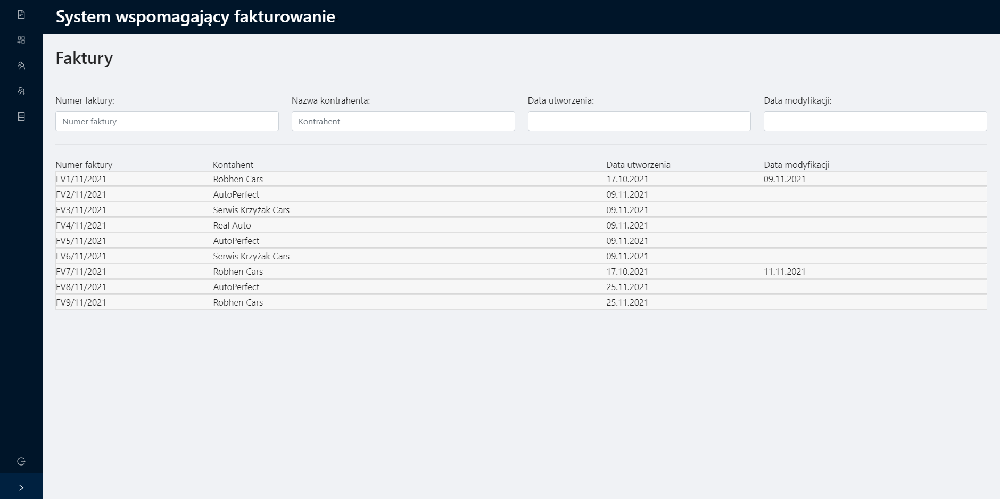
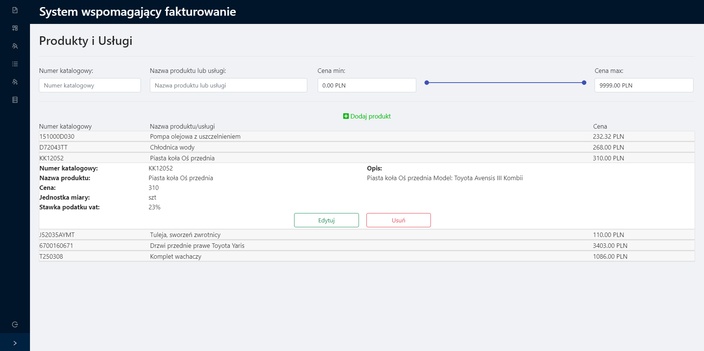
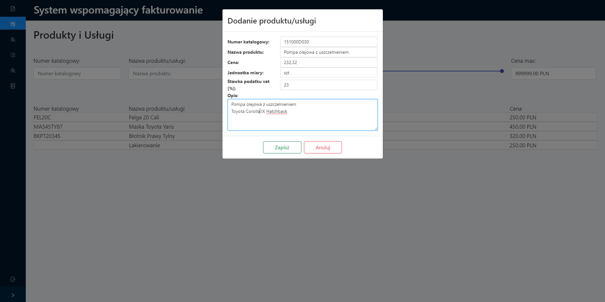
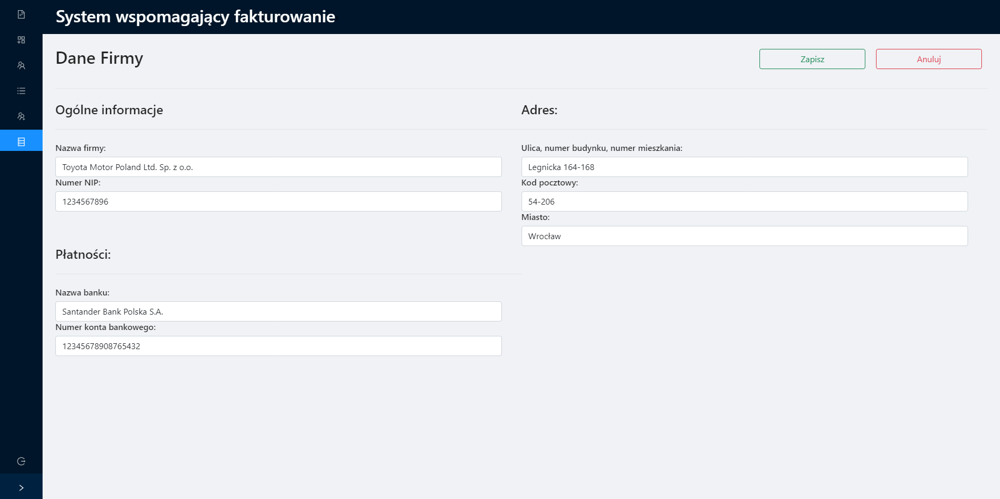

# InvoicingSystem
InvoicingSystem is a application allowing user to manage products, services, employees and invoices. System is designed for 3 roles:
* Accountant 
* Administrator
* Manager

### Accountant
This role allows to create, delete and modify products, services. User also can Creating, editing invoices and export them PDF file.
### Administrator
This role extends Accountant role by option to manage users. Administrator can create edit and archive user account and also edit the login credentials.
### Manager
This role extends Accountant role by option to managing the contractors. The manager have possibility to assign contractor to accountant under his management, after that accountant have access to invoices for this contractor.

## Technologies
Technologies utilized while creating this project:
Database:
* MSSQL
Backend:
* .Net Core
* Entity Freamwork
* Auto Mapper
* Swagger
* Select.HtmlToPdf
Frontend:
* React
* Ant Design
* Bootstrap

## Views
### Login Page

### Login Page

### List of Invoices

### Invoice Creator

### Invoice Preview Mode

### Exported Invoice Example

### Product and Service List

### Creating Product or Service form

### List of Contractor

### Creating Contractor form

### Managing Contractor assignment to Accountants

### List of Users

### Managing Company Data form

